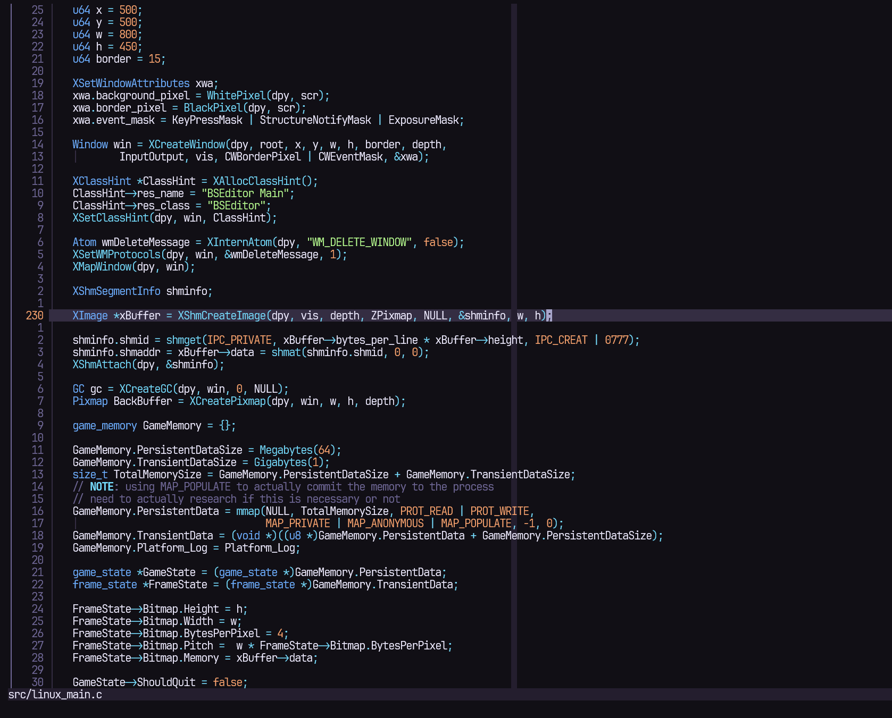

# rtheme (Rodolfo Theme)

This is my personal Neovim theme. It is heavily inspired by "rose pine" and "tokyo night" but all the colors were chosen myself. 

I decided to do this as I felt there were too many highlight groups that I felt overwhelmed when looking at code, and it was too much work to fix existing color schemes.

Usually I turn off semantic tokens from my LSPs as well to prevent more highlights from being added. I may later support LSP, however the ethos would be the same and there won't be many colors added for superfluous things.

---

## Extra

I have included some extra color schemes for terminals that I use. I don't personally use anything other than windows terminal and kitty so I don't have color schemes for other terminals. Feel free to create one and submit it if you'd like to make it a part of this repository.

- **Kitty:** `extras/rtheme.conf`
- **Windows Terminal:** `extras/settings.json`
- **Helix:** `extras/helix_rtheme.toml`
- **Ghostty:** `extras/ghostty_rtheme`
- **Vim:** `extras/rtheme.vim` (requires Vim 8.0+ with `+termguicolors`; set `let g:rtheme_transparency = 1` before sourcing for transparency)
